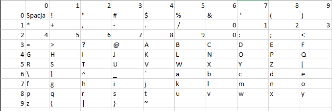

# MASM

## EN

Laboratories in the subject of low-level programming with the following topics:
- MASM basics
- data transfer
- arithmetic and logical instructions
- controlling the course of the program
- operations on files and directories
- procedures and macro instructions
- math coprocessor
- GUI
- assembler inserts
- x64 programming

## Project

Text file encryption according to the algorithm:

where each printed character is assigned a row and column number

## Requirements

- [MASM](https://www.masm32.com/ "MASM website")
- .inc and/or .lib files:
    - fpu
    - kernel32
    - masm32
    - user32
    - windows

## PL

Laboratoria z przedmiotu programowanie niskopoziomowe z zagadnień:
- podstawy MASM
- przesyłanie danych
- instrukcje arytmetyczne i logiczne
- sterowanie przebiegiem działania programu
- operacje na plikach i katalogach
- procedury i makroinstrukcje
- koprocesor matematyczny
- GUI
- wstawki asemblerowe
- programowanie x64

## Projekt

Szyfrowanie pliku tekstowego według algorytmu:

gdzie każdemu znaku drukowanemu zostaje przypisany numer wiersza i kolumny

## Wymagania

- [MASM](https://www.masm32.com/ "strona MASM")
- .inc i/lub .lib pliki:
    - fpu
    - kernel32
    - masm32
    - user32
    - windows